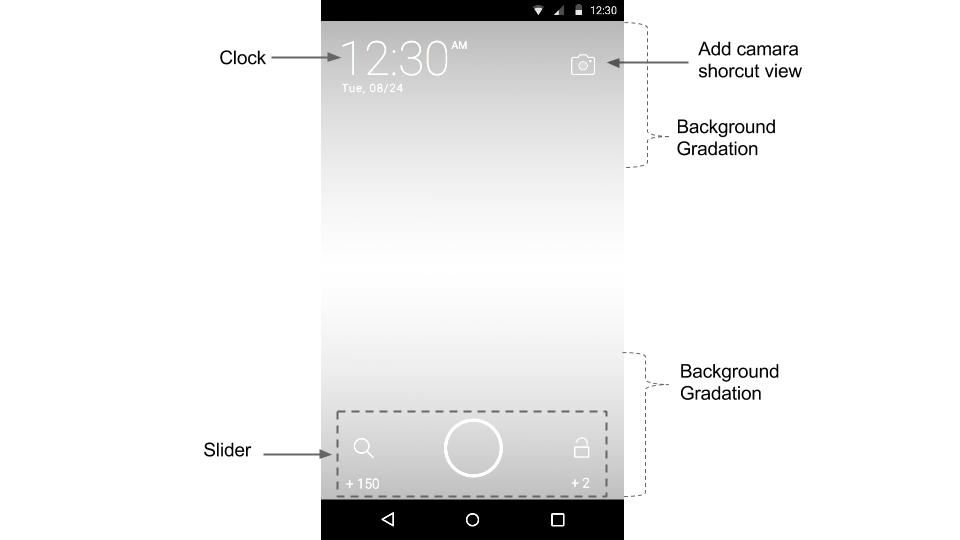

# BuzzScreen SDK Integration Guideline - Advanced
Before reading this document, please read [BuzzScreen SDK Integration Guideline - Basic](README_EN.md) first.
- [Lock screen customization](#lock-screen-customization) : Changing watch UI and lock screen slider UI (swiping UI), and adding widgets
- [Process separation](#process-separation) : Separating lock screen process from main process in order to increase efficiency in memory usage
- [Distributing point accumulation request traffic](#distributing-point-accumulation-request-traffic) : Distributing point accumulation request traffic which is concentrated on the hour


## Lock screen customization
Reference Sample : **buzzscreen-sample-custom**

Lock screen consists of one activity and just like standard activity, you may create layout and call a few essential functions inside activity class. When you customize lock screen, please use **buzzscreen-sdk-core** instead of **buzzscreen-sdk-full** in the integration process.

#### Layout

Layout basically consists of watch, slider, and background gradation like below. You may also add additional views if necessary.  
> Reference : [Layout Guideline](https://drive.google.com/file/d/0BxlsmkGYXVSyYUhDREkxYTl6STg/view?usp=sharing)



- Watch : Add a view to layout, and process it at onTimeUpdated inside activity.
- Slider : You may change all the image files that form the slider.

    |Slider Attribute|Description|
    |--------|--------|
    |slider:left_icon|left icon of slider|
    |slider:right_icon|right icon of slider|
    |slider:pointer|center image of slider|
    |slider:pointer_drag|center image of slider when touching on|
    |slider:radius|the distance between slider center and the center of left/right icons|

- Background Gradation : As readability of watch and slider may be affected by color of campaign images, it is necessary to set up background gradation under the UI.
- Adding additional views : Just like standard view, you may add a view to layout, and write a feature inside activity.

#### Activity Class
Please create an activity inheriting BaseLockerActivity and this activity class should be delivered to initilization function(BuzzScreen.init). Slider and watch are required to be implemented inside Activity, and the others are optional.

##### Slider
Slider is an independent view from lock screen so it is required to complete two more steps in order to connect it with lock screen.
- Setting listners for left/right slider : You may set up listenrs for left/right slider through Slider.setLeftOnSelectListener , Slider.setRightOnSelectListener . Please call either unlock function or landing function in align with sliding direction. 
- Left/Right point update : It is necessary to change left/right point in accordance with campaign type. Please find onCurrentCampaignUpdated, a function in the Activity called at the point of campaign change, and update Slider.setLeftText and Slider.setRightText.

##### Watch
Update the view in layout according to time change. As onTimeUpdate in Activity is to be called every minute, please update the view here.

##### Etc
- Previous/Next Page Icon : When touching lock screen, you may show (ideally arrow) icon on whether there would be previous or/and next page on lock screen when swiping up & down. Please call setPageIndicators and set up a view.
- setOnTrackingListener : Impression and click event can be tracked through this Listner.

## Process Separation
Reference Sample : **buzzscreen-sample-multi-process**

BuzzScreen SDK is always running/using Android's service component in the Foreground. Thus, in case BuzzScreen service is running in the same process with Publisher's app, memory for BuzzScreen will be managed together with main process, which will result in inefficient memory usage. To prevent this, it's necessary to separate the process in whcih BuzzScreen is running from the main process.

#### How to apply
- Modifying initialization function : From BuzzScreen.init function, please set useMultiProcess true.
- Please add MultipleProcessesReceiver to Android Manifest file.
```Xml
<receiver
    android:name="com.buzzvil.buzzscreen.sdk.MultipleProcessesReceiver"
    android:process=":locker" />
```

- Please add android:process=":locker" attribute to existing BuzzsScreen component in Android Mainfest file.

>The same as process attribute used in MultipleProcessesReceiver

    Components in which the attribute should be added : SimpleLockerActivity(In case customizing lock screen, it should be apply to the activity controlling the lock screen), LandingHelperActivity, LockerService, ChangeAdReceiver, DownloadAdReceiver


> **Precautions on process separation** : After applying process separation, Lock screen is running separately from publisher app's main process, please be careful when developing a feature related to pubslisher's app on the lock screen area.


## Distributing Point Accumulation Request Traffic
When BuzzScreen makes a point accumulation requests to publisher's server, the traffic could be not evenly distributed over time and rather concentrated every hour on the hour as BuzzScreen SDK's initial setting is developed to initialize the point accumulation logic every hour. In order to distribute the traffic, please call BuzzScreen.init and BuzzScreen.set.BasePointsSpreadingFactor together. 
A parameter delivering to BuzzScreen.setBasePointsSpreadingFactor should be integer, from 0 to 30. Please apply as below:
```Java
public class App extends Application {

    @Override
    public void onCreate() {
        super.onCreate();
        ...
        // app_key : unique key value for publisher. Please check it on the BuzzScreen admin page.
        // SimpleLockerActivity.class : lock screen activity class
        // R.drawable.image_on_fail : a back fill image to be shown when network error occurs or there is no campaign available.
        // useMultiProcess : if lock screen is separated from main process, it's true. if not, it's false.
        BuzzScreen.init("app_key", this, SimpleLockerActivity.class, R.drawable.image_on_fail, false);
        // If distributing the traffic from 0 to 10 min
        BuzzScreen.setBasePointsSpreadingFactor(10);
    }
}
```

> Please keep in mind that by usign this feature, you might potentially give different experience for each user.
