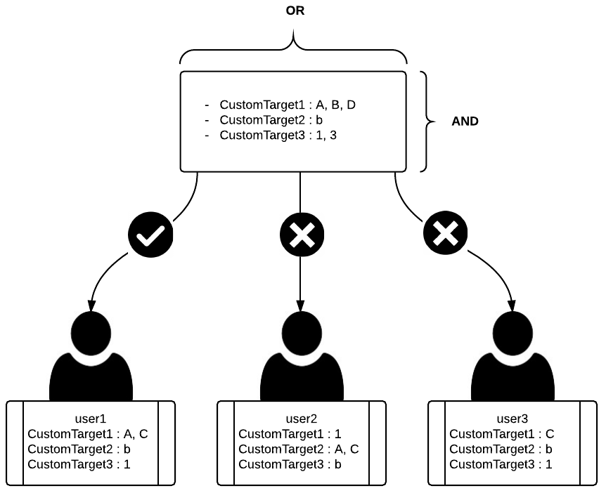
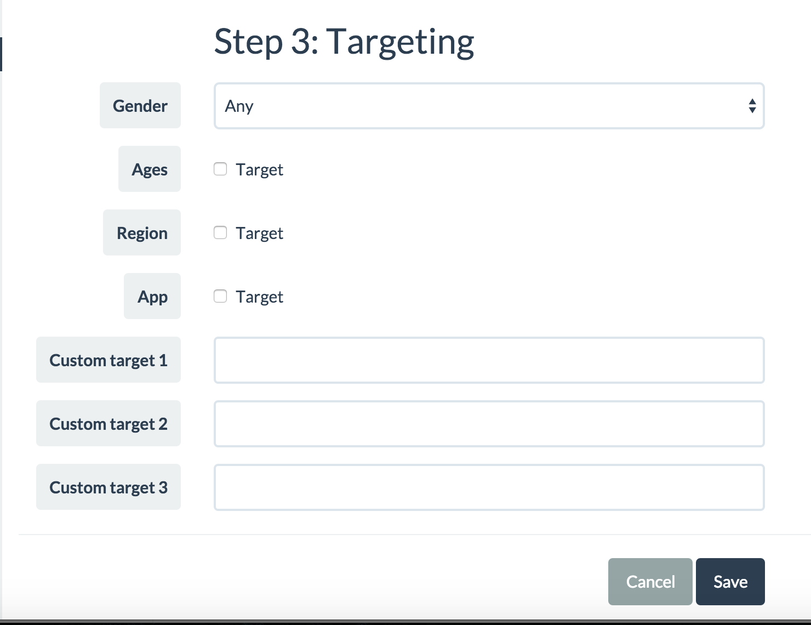

# BuzzScreen Custom Targeting
- 유저에게 캠페인을 할당할 때, SDK에서 기본적으로 제공하는 타게팅 필드(나이, 성별, 지역) 외에 퍼블리셔에 의해 커스터마이징 된 필드를 통해 더 구체적인 타게팅을 할 수 있다.
- 최대 3개의 커스텀 타게팅 필드를 제공한다.
- 캠페인 운영자가 버즈스크린 어드민에서 캠페인을 등록할 때 캠페인에 커스텀 타게팅 정보를 설정하고, 앱 개발자가 앱 내에서 유저의 커스텀 타게팅 정보를 설정함으로써 커스텀 타게팅이 이루어진다.

## 용어 설명
- 타게팅 필드 : 캠페인을 모든 유저가 아닌 분류된 유저에게만 할당시키고 싶을 때, 유저들을 분류할 수 있는 특정한 속성을 타게팅 필드라 한다.
- 타게팅 항목 : 타게팅 필드를 구성하는 원소 하나하나를 타게팅 항목이라 한다.

> 유저들의 '성별' 속성은 유저를 '남성', '여성' 으로 분류할 수 있다. 따라서 '성별'은 타게팅 필드이며, '남성', '여성'은 이 필드에 속하는 타게팅 항목들이다.

## 주의사항
- 캠페인에 설정된 타게팅 필드는 할당을 위한 **조건**으로 작용하여, 해당 조건을 만족하는 유저에게만 캠페인이 할당될 수 있게 한다.
	
	> 아무 타게팅 필드도 설정되지 않은 캠페인은 조건이 없이 모든 유저에게 할당되며, 타게팅 필드가 추가될수록 조건이 추가되어 일반적으로 할당 받는 유저의 범위가 좁아진다.

- 유저에게 설정된 타게팅 필드는 할당을 위한 **자격**으로 작용하여, 타게팅 조건이 걸린 캠페인을 해당 유저가 받아올 수 있는지 여부를 판단하기 위해 사용된다.
	
	> 아무 타게팅 필드도 설정되지 않은 유저는 조건이 없는 캠페인만 할당 받을 수 있으며, 타게팅 필드가 추가될수록 이전에 할당 받지 못한 캠페인을 할당 받을 수 있는 자격이 추가된다.

- 캠페인, 유저 모두 다수의 타게팅 필드를 설정할 수 있으며, 하나의 타게팅 필드에 다수의 타게팅 항목을 설정할 수 있다.

- 캠페인에 설정된 다수의 타게팅 필드는 '**AND**' 조건과 같은 역할을 하여 유저가 모든 필드의 조건을 동시에 만족해야 그 캠페인을 할당받을 수 있다.
	
	> 기본 타게팅 필드(나이, 성별, 지역)와 커스텀 타게팅 필드 모두 적용되며, 모두 동등한 우선순위를 가진다.

- 캠페인의 특정 타게팅 필드에 설정된 다수의 타게팅 항목은 '**OR**' 조건과 같은 역할을 하여 유저가 가진 타게팅 항목이 이 중 하나 이상에 해당되면 해당 필드의 조건이 만족된다.
	
	> 캠페인과 유저 간에 특정 타게팅 필드에 설정된 타게팅 항목에 겹치는 요소가 하나 이상이면 유저는 해당 필드의 할당 조건을 만족한 것이다.

- 커스텀 타게팅 용으로 제공된 3개의 필드는 서로 독립적으로 취급하여 캠페인과 유저 정보간 같은 번호의 필드끼리만 비교한다.
	
	> 기존 타게팅 필드에서 캠페인의 '나이' 필드는 유저의 '나이' 필드와만 비교할 뿐 유저의 '성별' 필드에서 비교하지 않는 것처럼 CustomTarget1 ,2, 3 필드도 각각 같은 번호의 필드와만 비교한다. 따라서 제공하는 커스텀 타게팅 필드 번호별로 어떠한 내용을 적용할 것인지 사전 정의가 필요하다.

### 예시

- user1의 경우 모든 타게팅 필드에서 유저와 캠페인 간 하나 이상의 겹치는 항목이 존재하므로 할당 조건을 만족해서 캠페인을 할당받을 수 있다. CustomTarget1, 3은 멀티 타게팅을 이용하고 있는데, 유저는 반드시 모든 항목을 가지고 있을 필요는 없이 그 중 하나 이상에만 해당이 되면 된다(OR 조건).
- user2의 경우 user1과 비교했을 때 가지고 있는 항목의 내용은 똑같지만 잘못된 번호의 필드에 항목이 설정되어 있으므로 캠페인을 할당받을 수 없다. 캠페인과 유저 정보간 같은 번호의 필드끼리만 비교하기 때문에, 이 경우 모든 필드에서 겹치는 항목이 하나도 없어서 조건을 전부 만족하지 못하게 된다.
- user3의 경우 CustomTarget1 필드에서 캠페인과 겹치는 항목이 하나도 없으므로 이 필드의 조건을 만족하지 못하고, 각 필드는 AND 조건이기 때문에 이 조건을 만족하지 않으면 최종 캠페인 할당이 불가능하게 된다.

## 커스텀 타게팅 적용 순서
커스텀 타게팅을 적용하기 위해서는 `커스텀 타게팅 필드 정의 -> 필드 내 항목 정의 -> 타게팅 적용` 의 단계를 따라야 한다.

### 1. 커스텀 타게팅 필드 정의
제공하는 커스텀 타게팅 필드 1, 2, 3을 퍼블리셔에서 각각 어떤 내용의 타게팅 필드로 운영할지 정의한다.

- Ex. CustomTarget1 = Interest, CustomTarget2 = Marital status 로 정한다.

> 주의 : 단순히 필드만 정의하는 것이 아니라 제공하는 커스텀 타게팅 필드의 번호와 매칭시켜서 정의해야 한다. 필드는 번호별로 독립적이므로 이 단계에서 번호를 정의해 놓지 않으면 나중에 캠페인 할당 시 번호가 매칭되지 않아서 문제가 생길 수 있다.(상위 예시의 user2 참조)

### 2. 필드 내 항목 정의
정의된 각각의 커스텀 타게팅 필드에 들어갈 커스텀 타게팅 항목을 정의한다.

- Ex. `Interest` 필드에는 Book, Travel, Music, Sports 가 항목으로 들어가고, `Marital status` 필드에는 Married, Single 가 항목으로 들어가게 정한다.

> 주의 : 여기서 설정한 항목들은 이후 타게팅 적용 시 유저 정보와 캠페인 정보간 표현 형식이 통일되어야 한다.

### 3. 타게팅 적용
#### 유저 타게팅 정보 설정
- `BuzzScreen.getInstance().getUserProfile()` 을 통해 UserProfile을 가져온다.
- 가져온 UserProfile에  `setCustomTarget1()`, `setCustomTarget2()`, `setCustomTarget3()` 메소드를 통해 유저에게 해당되는 타게팅 정보를 String 으로 입력한다.
- 여러 개의 타게팅 항목을 설정할 경우, 각 항목을 빈 칸 없이 쉼표로 구별하여 하나의 String으로 입력한다.(예제 참조)

##### 코드 예제
```Java
	UserProfile userProfile = BuzzScreen.getInstance().getUserProfile();
	
	userProfile.setUserId(...);
	userProfile.setBirthYear(...);
	...
	// CustomTarget1 : Interest
	userProfile.setCustomTarget1("music,travel");
    // CustomTarget2 : Marital status
    userProfile.setCustomTarget2("married");
```

#### 캠페인 타게팅 정보 설정
admin에서 캠페인 등록 시 타게팅 정보를 설정하는 부분으로, 'Custom target 1, 2, 3' 이 커스텀 타게팅 정보를 입력하는 필드이다.
