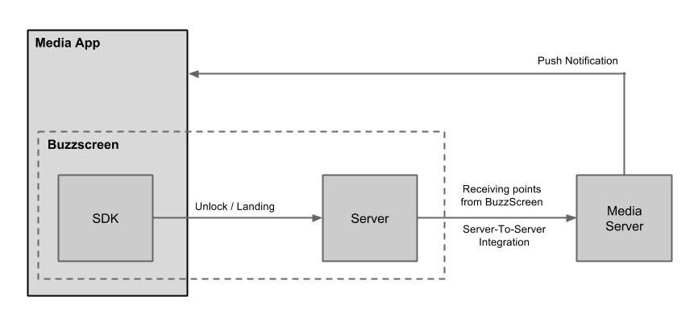

# BuzzScreen SDK for Android
- Buzzvil's library for integrating BuzzScreen with Android apps.
- Requires Android version 4.0.3 (API level 15) or newer.
- Below are the key values necessary for the integration:
	* `app_key` : Please find the `app_key` on your BuzzScreen dashboard. Please ask your account manager if the account details are not provided yet. ([Required in the `BuzzScreen.init` method](#1-initialization--call-init-and-launch))
	* `app_license` : Please ask your account manager. ([Required in the `AndroidManifest.xml` setting](#add-the-following-codes-to-androidmanifestxml))
	* `plist` : Please ask your account manager. ([Required in the `AndroidManifest.xml` setting](#add-the-following-codes-to-androidmanifestxml))
- It is required to submit the integrated APK file to your account manager for review before going live.


## Integration guide - simple version
Our simplest integration method – add BuzzScreen to your Android application in just a few easy steps.

The reference sample : **sample/basic**
> Please refer to the sample included in the SDK before applying to your app.

### 1. Add Libraries

#### Add the following codes to `build.gradle` in your app module.

```
repositories {
    maven { url "https://dl.bintray.com/buzzvil/buzzscreen/" }
    maven { url "http://dl.appnext.com/" }
}

...

dependencies {
    compile 'com.buzzvil:buzzscreen:1.+'
    compile 'com.google.android.gms:play-services-ads:8.4.0'
    compile 'com.google.android.gms:play-services-location:8.4.0'
}

```
> Please change the version number (8.4.0) in `com.google.android.gms:play-services-ads:8.4.0` and `com.google.android.gms:play-services-location:8.4.0` to match the version number of Google Play Services in your app.
Otherwise you might get compile errors such as `com.android.dex.DexException`. If you encounter any errors, please do not hesistate to contact your account manager.

#### Add the following codes to `AndroidManifest.xml`.
```Xml
<manifest>
    <application>
        ...
        <!-- Configuration for BuzzScreen-->
        <meta-data
            android:name="app_license"
            android:value="<app_license>" />
        <meta-data
            android:name="com.buzzvil.locker.mediation.baidu.plist"
            android:value="<plist>" />
    </application>
</manifest>
```
> Please ask your account manager for `<app_license>` and `<plist>`.

### 2. Call Methods
In order to integrate BuzzScreen into Android apps, please follow the 3 steps below:
	**1) Initialization -> 2) Set User Profile -> 3) Turn on/off the Lock Screen**


#### 1) Initialization : call init() and launch()
- `BuzzScreen.init()` : Place this code in the onCreate() in your application class. You MUST call this method prior to any other method calls of the Buzzscreen SDK. Please see the required parameters below.
   - String appKey : `app_key`. Please find the `app_key` on your BuzzScreen dashboard. 
   - Context context : The application context (you can simply use `this`)
   - Class<?> lockerActivityClass : A Lock screen activity class. You can simply use `SimpleLockerActivity.class` which is already provided in the SDK. You can also implement your own lock screen activity class to suit unique needs of yours, by subclassing `BaseLockerActivity.class`. Please refer to 'Lock Screen Customization' on [BuzzScreen SDK Advanced Integration](docs/ADVANCED-USAGE_EN.md)
   - int imageResourceIdOnFail : An image file to be displayed when either network error occurs or there is no campaign available temporarily. Include the file as resource inside the app. Use the resource id of the image.
 
     > **Note** : If it is the first time to create application class in your app, please do not forget to register application class in AndroidManifest.xml
     
```Java
public class App extends Application {

    @Override
    public void onCreate() {
        super.onCreate();
        ...
        // app_key : `app_key` for SDK usage. Find it on your BuzzScreen dashboard.
        // SimpleLockerActivity.class : Lock screen activity class
        // R.drawable.image_on_fail : An image file to be displayed when either network error occurs or there is no campaign available temporarily
        BuzzScreen.init("app_key", this, SimpleLockerActivity.class, R.drawable.image_on_fail);
    }
}
```

- `BuzzScreen.getInstance().launch()` : Call this method in the very first activity of your app.


#### 2) Set User Profile
- `UserProfile` : You can set user profile information in this Class. You must call `setUserId(String userId)` in order for the SDK to behave correctly. `userId` is a unique value by which publishers can identify each user. This value will be passed back to your server in a postback when there's a reward accumulation event. Ad campaigns will be targeted to specific demo by using information set by `setBirthYear` and `setGender` methods.

- You can get `UserProfile` by calling `BuzzScreen.getInstance().getUserProfile()`.

##### A list of set methods in UserProfile Class
- `setUserId(String userId)` : Set User Id (**Required**)
- `setBirthYear(int birthYear)` : Set age by Year of Birth of the user in 4 digits (e.g, 1988)
- `setGender(String gender)` : Set gender by using predefined string constants below: 
    - `UserProfile.USER_GENDER_MALE` : For male
    - `UserProfile.USER_GENDER_FEMALE` : For female
    
> Keep in mind that you must set userId before calling `BuzzScreen.getInstance().activate()`


#### 3) Turn on/off the Lock Screen
- `BuzzScreen.getInstance().activate()` : Turn on BuzzScreen. 

    - `activate()` doesn't need to be called repeatedly unless `deactivate()` is called. BuzzScreen will be kept activated once activate() is called and lock screen cycle will be managed automatically since then. 

    - If un-removable ongoing notification is created at Notification area after calling this method, please refer to [Lock Screen Service Notification](docs/LOCKSCREEN-SERVICE-NOTIFICATION_EN.md). The guide shows you how to make use of the notification.
    
    - You can get a callback when the lock screen is ready. Implement and provide the following interface and pass it as the parameter for the activate() method as `BuzzScreen.getInstance().activate(ActivateListener listener)`
          
        ```Java
        public interface ActivateListener {
            void onReady();// This will be called when the first lockscreen is ready to be shown.
        }
        ```   

- `BuzzScreen.getInstance().deactivate()` : Turn off BuzzScreen.
    - `BuzzScreen.getInstance().logout()` : Call this when the user has loggeed-out. This method calls `deactivate()`, and removes all the UserProfile related info from the device.


### 3. Reward Accumulation (via Postback) - Server to Server Integration
- When a reward accumulation event occurs from a user, BuzzScreen does not handle this in the client side. Instead the BuzzScreen server will make a reward accumulation request to the publisher's server and the publisher's server should process the request and provide rewards for the user.

- Regarding implementing the postback, please refer to [BuzzScreen's Postback API guidelines](docs/POSTBACK_EN.md).

> If you would like to send the user a push notification on point accumulation, it should be processed/sent from your server after receiving a reward accumulation request from BuzzScreen.

#### Point accumulation request flow:



### 4. Additional Features
- If you need any of the following features, please refer to [BuzzScreen SDK Integration Guideline - Advanced](docs/ADVANCED-USAGE_EN.md):
    - Customized lock screen, slider UI, clock UI, or extra lock screen widgets.
    - Separating the lock screen process from main process for efficient memory usage.

- To enable customized targeting features, please refer to ["BuzzScreen Custom Targeting"](docs/CUSTOM_TARGETING_EN.md).

- To customize lockscreen service notification, please refer to [Locksceen Service Notification Guideline](docs/LOCKSCREEN-SERVICE-NOTIFICATION_EN.md).

## Open Source Software License Notice
_ Licenses of Open Source Software used by this software are available on the "Open Source Software License Notice ([raw file](docs/3rd_party_licenses.html)|[rendered version](https://htmlpreview.github.io/?https://github.com/Buzzvil/buzzscreen-sdk-publisher/blob/master/docs/3rd_party_licenses.html))" page.
