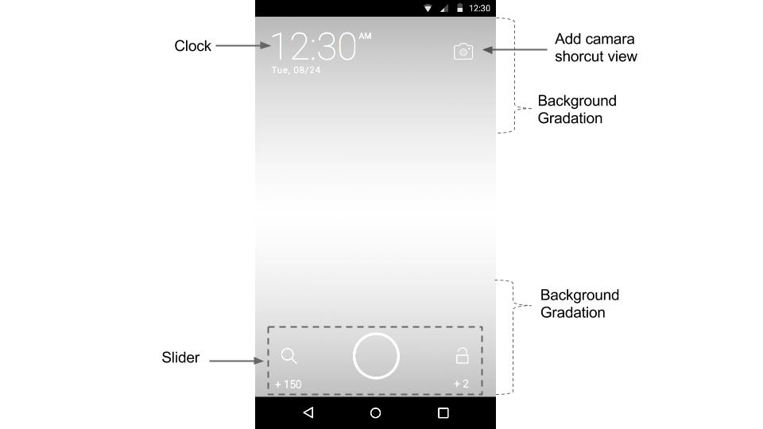

# 버즈스크린 SDK 연동 가이드 - 고급
["버즈스크린 SDK 연동 가이드 - 기본"](https://github.com/Buzzvil/buzzscreen-sdk-publisher#버즈스크린-sdk-연동-가이드---기본)을 먼저 진행한 후에 필요에 따라 본 문서 내용을 진행한다.
- [잠금화면 커스터마이징](#잠금화면-커스터마이징) : 시계 및 하단 슬라이더 UI 변경, 위젯 추가
- [프로세스 분리](#프로세스-분리) : 메모리의 효율적 사용을 위해 프로세스 분리 지원
- [추가 기능](#추가-기능) : 간단한 기능 모음

## 잠금화면 커스터마이징
참고 샘플 : **sample/custom**
> 반드시 샘플을 확인하고 실제 자신의 코드에 적용바랍니다.

잠금화면은 하나의 액티비티로 구성되며, 일반적인 액티비티와 마찬가지로 레이아웃을 만들어주고, 액티비티 클래스 내에서 몇가지 필수 함수들을 호출 혹은 구현해주면 된다.

### 레이아웃
레이아웃에는 필수적으로 **시계, 슬라이더**가 포함되어 있어야 하며, 캠페인 이미지에 따라 뷰들의 가독성이 떨어지지 않게 하기 위해 배경 그라데이션을 추가하는 것이 좋다. 그 외에 커스텀화 된 기능을 위한 뷰(아래 그림의 카메라 shortcut 등)를 추가할 수 있다.
>참고:[레이아웃 가이드라인](https://drive.google.com/file/d/0B1aKRQxB-KLJZlpHbjdNaFBBTms/view?usp=sharing)



- 시계 : 레이아웃에 뷰를 추가하고, 해당 뷰에 표시되는 값은 액티비티 내의 `onTimeUpdated`에서 처리한다.
- 슬라이더 : 슬라이더를 구성하는 모든 이미지들을 변경할 수 있다.

    |슬라이더 속성|설명|
    |--------|--------|
    |slider:sl_left_icon|슬라이더의 왼쪽 아이콘|
    |slider:sl_right_icon|슬라이더의 오른쪽 아이콘|
    |slider:sl_pointer|슬라이더의 가운데 이미지|
    |slider:sl_pointer_drag|슬라이더의 가운데 눌렀을 때 이미지|
    |slider:sl_radius|슬라이더 중심과 좌우 아이콘 중심까지의 반지름|
    |slider:sl_text_size|슬라이더의 포인트 텍스트의 크기(Default : 14sp)|
    
    슬라이더 속성 사용 예제
	```Xml
    <com.buzzvil.buzzscreen.sdk.widget.Slider
        android:id="@+id/locker_slider"
        android:layout_width="match_parent"
        android:layout_height="wrap_content"
        android:layout_alignParentBottom="true"
        android:layout_centerHorizontal="true"
        android:layout_marginBottom="8dp"
        slider:sl_left_icon="@drawable/locker_landing"
        slider:sl_pointer="@drawable/locker_slider_normal"
        slider:sl_pointer_drag="@drawable/locker_slider_drag"
        slider:sl_radius="128dp"
        slider:sl_right_icon="@drawable/locker_unlock"
        slider:sl_text_size="14sp" />
    ```

- 배경 그라데이션 : 현재 보여지는 캠페인 이미지에 따라 시계 및 슬라이더의 가독성이 떨어질 수 있으므로 해당 UI 뒤에 배경 그라데이션을 넣어준다.
- 뷰 추가 : 일반적인 뷰와 같이, 원하는 뷰를 레이아웃에 배치하고, 기능은 액티비티 내에서 구현한다.

### 액티비티 클래스
`BaseLockerActivity`를 상속받아서 잠금화면 액티비티 클래스를 생성하고, 초기화 함수(BuzzScreen.init)의 3번째 파라미터에 생성한 액티비티 클래스를 지정해준다. 액티비티 내에서 구현해야하는 필수 요소는 **슬라이더, 시계**이며 그외는 선택에 따라 직접 구현하면 된다.

#### `AndroidManifest.xml` 설정
`BaseLockerActivity`를 상속받은 클래스 이름이 `CustomLockerActivity` 인 경우
```Xml
<manifest>
    <application>
        ...
        <activity
            android:name=".CustomLockerActivity"
            android:excludeFromRecents="true"
            android:launchMode="singleTask"
            android:screenOrientation="portrait"
            android:taskAffinity="${applicationId}.Locker" />
    </application>
</manifest>

```
> excludeFromRecents, launchMode, screenOrientation, taskAffinity 속성은 반드시 위의 값으로 설정되어야 한다.

#### 슬라이더
슬라이더는 잠금화면과 독립적인 뷰이기 때문에 잠금화면과의 연동을 위해서는 크게 두가지 작업을 해야 한다.
- 좌/우 슬라이더 선택에 따른 리스너 등록 : `Slider.setLeftOnSelectListener` , `Slider.setRightOnSelectListener` 를 통해 좌/우 선택에 따른 리스너를 등록해야 한다. 좌/우 선택 이벤트 발생시에 잠금해제(unlock) 함수를 호출하거나 링크이동(landing) 함수를 호출한다.
- 좌/우 포인트 업데이트 : 캠페인 롤링 시 각각의 캠페인에 따라 화면에 표시되는 좌/우 포인트 변경이 필요하다. 캠페인 롤링 시 캠페인이 변할 때마다 `BaseLockerActivity` 내의 함수인 `onCurrentCampaignUpdated` 가 호출되므로 이를 오버라이딩하여 이 함수의 파라미터로 전달되는 campaign 정보를 이용해 `Slider.setLeftText`와 `Slider.setRightText`를 통해 포인트 정보를 업데이트 해야 한다.

#### 시계
레이아웃에서 배치한 뷰를 시간변화에 따라 업데이트 해준다. 시간이 분 단위로 업데이트 될때마다 `BaseLockerActivity` 내의 함수인 `onTimeUpdated`가 호출되므로 이를 오버라이딩하여 이 함수의 파라미터로 전달되는 시간 정보를 이용해 time, am/pm, date 등의 정보를 업데이트 해야 한다.

> 주의 - 잠금화면 액티비티에서 `onCurrentCampaignUpdated` 와 `onTimeUpdated` 를 오버라이딩하여 구현하지 않으면 오류가 발생하므로 반드시 구현해야 한다. 구체적 사용 예시는 샘플 내의 **CustomLockerActivity.java** 참고.

#### 추가적으로 제공되는 기능

##### 전/후 페이지 유무 표시
잠금화면 터치시에 전/후 페이지 유무를 표시할 수 있다. 이를 위해서는 `setPageIndicators` 를 호출하여 표시할 뷰를 지정해준다.

Method prototype(in BaseLockerActivity)
```Java
// previous : 이전 페이지가 존재할 경우 표시할 뷰
// next : 이후 페이지가 존재할 경우 표시할 뷰
protected void setPageIndicators(View previous, View next) {
    ...
}
```

사용 예시
```Java
setPageIndicators(
	findViewById(R.id.locker_arrow_top),
	findViewById(R.id.locker_arrow_bottom)
);
```

##### 임프레션 및 클릭 이벤트 트래킹
`setOnTrackingListener()` 를 이용하여 TrackingListener를 설정해 임프레션, 클릭시 원하는 기능을 구현할 수 있다.

사용 예시
```Java
setOnTrackingListener(new OnTrackingListener() {

	@Override
    public void onImpression(Campaign campaign) {
    	//Impression 시 원하는 기능 구현
	}

    @Override
    public void onClick(Campaign campaign) {
    	//Click 시 원하는 기능 구현
    }

});
```

##### 잠금화면 캠페인 전환 효과 커스터마이즈
`setPageTransformer()` 를 통해 잠금화면 캠페인의 전환 효과를 커스터마이징 할 수 있다. 파라미터로 퍼블리셔가 구현한 ViewPager.PageTransformer 를 전달한다.

- ViewPager 의 PageTransformer 를 설정하는 방법은 [안드로이드 가이드 문서](http://developer.android.com/intl/ko/reference/android/support/v4/view/ViewPager.PageTransformer.html#transformPage(android.view.View, float))를 참조한다.

Method prototype(in BaseLockerActivity)
```Java
protected void setPageTransformer(ViewPager.PageTransformer transformer) {
    ...
}
```

사용 예시
```Java
setPageTransformer(new ViewPager.PageTransformer() {
    @Override
    public void transformPage(View page, float position) {
        if (Build.VERSION.SDK_INT >= 11) {
            int pageHeight = page.getHeight();
            if (0 <= position && position <= 1) {
                page.setTranslationY(pageHeight * -position + (position * pageHeight / 4));
            }
        }
    }
});
```

##### 적립 시도 성공 및 실패 알림 기능
`OnPointListener` 인터페이스를 통해 포인트 적립 시도가 성공적으로 발생했을 때(onSuccess), 유저의 네트워크 에러로 현재 적립 시도가 불가능할 때(onFail) 에 대해 알림을 구현할 수 있다. 구현된 interface를 `setOnPointListener(OnPointListener listener)` 메소드를 통해 등록하여 사용한다.
> setOnPointListener(OnPointListener pointListener) 메소드는 `BuzzScreen` class에 정의되어 있다. 따라서 사용할 때는 `BuzzScreen.getInstance().setOnPointListener(...)` 으로 사용해야 한다. 반드시 `BuzzScreen.init()` 호출 이후 호출해야 한다.

```Java
interface OnPointListener {
    void onSuccess(PointType type, int points);
    void onFail(PointType type);
}
```
- PointType : 해당 포인트가 발생한 원인에 따라 UNLOCK(잠금해제 - 오른쪽 스와이프), LANDING(페이지 랜딩 - 왼쪽 스와이프) 두가지 중 하나로 정해져 전달된다.

- **주의**
	- 알림으로 뜨는 포인트는 즉시 적립 가능한 포인트만을 의미한다. 회원가입, 앱 실행형 등 액션을 마쳐야 적립이 이루어지는 광고의 경우 알림을 주지 않는다.
	- 이러한 상황에 대해서도 알림을 구현하려고 하는 경우에는 `OnTrackingListener` 의 `onClick(Campaign campaign)` 메소드를 이용해서 처리할 수 있다.([임프레션 및 클릭 이벤트 트래킹](#임프레션-및-클릭-이벤트-트래킹) 참고)

	> onClick 의 파라미터로 전달되는 캠페인에 대해 `campaign.getActionPoints()`를 통해 액션형 포인트를 얻은 후, 이 값이 0보다 크다면 해당 캠페인은 액션형 캠페인이므로 이 정보를 통해 알림을 직접 구현한다.

사용 예시
```Java
BuzzScreen.getInstance().setOnPointListener(new OnPointListener() {

    @Override
    public void onSuccess(PointType type, int points) {
        // 적립 요청 성공 메세지
        Toast.makeText(getApplicationContext(), points + " p 적립 요청이 완료되었습니다.", Toast.LENGTH_LONG).show();
    }

    @Override
    public void onFail(PointType type) {
        // 포인트 적립 실패 메세지
        Toast.makeText(getApplicationContext(), "네트워크 문제로 적립되지 않았습니다", Toast.LENGTH_LONG).show();
    }

});
```

## 프로세스 분리
참고 샘플 : **sample/multiProcess**
> 반드시 샘플을 확인하고 실제 자신의 코드에 적용바랍니다

버즈스크린을 동작시키는 서비스는 항상 실행중인 상태를 유지하고 있다. 이 때문에 버즈스크린 서비스가 매체사 앱(버즈스크린을 연동하려는 앱)과 같은 프로세스 내에서 동작하는 경우, 프로세스 단위 메모리 관리가 같이 되고, 이 때문에 메모리 사용량이 높게 측정 될 수 있다. 이를 막기 위해서는 버즈스크린 서비스가 실행되는 프로세스를 분리해야 한다.

### 적용 방법
`build.gradle`에서 `compile 'com.buzzvil:buzzscreen:1.+'` 대신 `compile 'com.buzzvil:buzzscreen-multi-process:1.+'` 를 추가한다.

```
dependencies {
    // compile 'com.buzzvil:buzzscreen:1.+'
    compile 'com.buzzvil:buzzscreen-multi-process:1.+'
}
```

#### 잠금화면 커스터마이징 사용하는 경우 추가 작업
커스터마이징한 잠금화면 액티비티도 분리된 프로세스에서 동작해야하기 때문에 `android:process=":locker"`를 AndroidManifest.xml 내의 커스터마이장한 잠금화면 속성에 아래와 같이 추가해야 합니다.
커스터마이장한 잠금화면이 CustomLockerActivity 인 경우
```Xml
<manifest>
    <application>
        ...
        <activity
            android:name=".CustomLockerActivity"
            android:excludeFromRecents="true"
            android:launchMode="singleTask"
            android:process=":locker"
            android:screenOrientation="portrait"
            android:taskAffinity="${applicationId}.Locker" />
    </application>
</manifest>
```

> **프로세스 적용 분리시 주의사항** : 잠금화면이 매체사 앱과는 다른 프로세스에서 구동되기 때문에 커스터마이징한 잠금화면에서 매체사 앱과 연관된 작업을 진행할때에는 구현에 주의를 요한다.

## 추가 기능
반드시 사용할 필요는 없지만 잠금화면 유저경험을 위해 제공하는 간단한 기능 모음

### 잠시 쉬기
버즈스크린을 잠시 꺼두기 위해 사용할 수 있습니다.
- `BuzzScreen.getInstance().snooze(int snoozeForSecs)` : 버즈스크린이 활성화된 상태에서 이 함수를 호출하면 snoozeForSecs 초 동안 버즈스크린이 잠금화면에 나타나지 않습니다. snoozeForSecs 후에 다시 자동으로 버즈스크린이 보여지게 됩니다.
	> snooze 후에 BuzzScreen.getInstance().activate() 를 호출하면 바로 다시 잠금화면이 보여지게 됩니다.

- `BuzzScreen.getInstance().isSnoozed()` : `BuzzScreen.getInstance().snooze(int snoozeForSecs)` 호출을 통해 현재 버즈스크린이 잠시 쉬는 상태인지 확인할 수 있습니다.
	> 버즈스크린이 보여지는 조건 : `BuzzScreen.getInstance().isActivated() && !BuzzScreen.getInstance().isSnoozed()`


