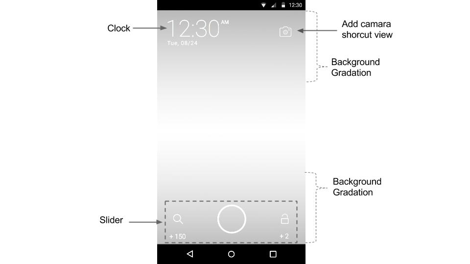

# BuzzScreen SDK Advanced Integration
*Please make sure to read [BuzzScreen SDK for Android](https://github.com/Buzzvil/buzzscreen-sdk-publisher#README_EN.md) first.*
- [Lock screen customization](#lock-screen-customization): Customized lock screen sliding/swiping UI, clock UI, and extra lock screen widgets.
- [Process separation](#process-separation): Separating the lock screen process from main process in order to increase memory usage efficiency.

## Lock screen customization
Sample files are located in **buzzscreen-sample-custom**.

The lock screen consists of one activity. Just like a standard activity, you should create the layout and call a few essential functions inside the activity class. If you customize the lock screen, please use **buzzscreen-sdk-core** instead of **buzzscreen-sdk-full** in the integration process.

### Layout
The layout basically consists of a clock, slider, and background gradation as below. You may add additional views if necessary.

[Layout Guideline](https://drive.google.com/file/d/0BxlsmkGYXVSyYUhDREkxYTl6STg/view?usp=sharing):



- Clock: Add a view to layout, and process it upon `onTimeUpdated()` inside your activity.
- Slider: You must change all the image files that make up the slider.

    |Slider Attribute|Description|
    |--------|--------|
    |slider:sl_left_icon|left icon of the slider|
    |slider:sl_right_icon|right icon of the slider|
    |slider:sl_pointer|center image of the slider|
    |slider:sl_pointer_drag|center image of the slider during touch|
    |slider:sl_radius|the distance between slider center and the center of left/right icons|
    |slider:sl_text_size|the size of the texts which show points(Default : 14sp)|

    Slider Attribute example
    ```Xml
    <com.buzzvil.buzzscreen.sdk.widget.Slider
        android:id="@+id/locker_slider"
        android:layout_width="match_parent"
        android:layout_height="wrap_content"
        android:layout_alignParentBottom="true"
        android:layout_centerHorizontal="true"
        android:layout_marginBottom="8dp"
        slider:sl_left_icon="@drawable/locker_landing"
        slider:sl_pointer="@drawable/locker_slider_normal"
        slider:sl_pointer_drag="@drawable/locker_slider_drag"
        slider:sl_radius="128dp"
        slider:sl_right_icon="@drawable/locker_unlock"
        slider:sl_text_size="14sp" />
    ```

- Background: As readability of clock and slider may be affected by the color of campaign images, it is necessary to set up a background gradation under the UI.
- Additional views: Just like a standard view, you may add a view to the layout, and write a feature inside the activity.

### Activity Class
Please create an activity inheriting `BaseLockerActivity` and pass it to `BuzzScreen.init()`. **The slider and clock** must be implemented inside Activity, while the others are optional.

#### Slider
Slider is an independent view from lock screen, so two more steps are required in order to connect it to the lock screen.

- Set up listeners for the slider through `Slider.setLeftOnSelectListener()` and `Slider.setRightOnSelectListener()`. Please call either the unlock function or the landing function depending on the sliding direction. 
- It is necessary to change the slide points in accordance with the campaign type. Please find `onCurrentCampaignUpdated()`, a function in the Activity called at the point of campaign change, and call `Slider.setLeftText()` and `Slider.setRightText()`.

#### Clock
If an `onTimeUpdate()` method is defined in your Activity, it will automatically be called by BuzzScreen every minute, upon which you should update your view.

#### Additional Feature
##### Previous/next page icons
Call `setPageIndicators()` and set up a view to display previous/next icons (ideally arrows) to indicate if there is more content that can be swiped up/down to.

Method prototype(in BaseLockerActivity)
```Java
// previous : View indicating that the previous page exists.
// next : View indicating that the next page exists.
protected void setPageIndicators(View previous, View next) {
    ...
}
```

Example

```Java
setPageIndicators(
    findViewById(R.id.locker_arrow_top),
    findViewById(R.id.locker_arrow_bottom)
);
```

##### Tracking Impression and Click Events
Impression and click events can be tracked through `setOnTrackingListener()`.

Example

```Java
setOnTrackingListener(new OnTrackingListener() {

    @Override
    public void onImpression(Campaign campaign) {
        // TODO
    }
    
    @Override
    public void onClick(Campaign campaign) {
        // TODO
    }
    
});
```

##### Customizing Lockscreen Campaign Transitional Effect
You can customize campaign transitional effect by passing your own `ViewPager.PageTransformer` as the parameter using `setPageTransformer()` method.

- Refer to [Android developer's guide about PageTransformer](http://developer.android.com/intl/ko/reference/android/support/v4/view/ViewPager.PageTransformer.html#transformPage(android.view.View, float)) to get the detail about how to customizing.

- **Caution** : This feature is only supported as of Android 3.0(API level 11) and forward.

Method prototype(in BaseLockerActivity)
```Java
protected void setPageTransformer(ViewPager.PageTransformer transformer) { 
    ... 
}
```

Example

```Java
setPageTransformer(new ViewPager.PageTransformer() {
    @Override
    public void transformPage(View page, float position) {
        if (Build.VERSION.SDK_INT >= 11) {
            int pageHeight = page.getHeight();
            if (0 <= position && position <= 1) {
                page.setTranslationY(pageHeight * -position + (position * pageHeight / 4));
            }
        }
    }
});
```

## Process separation
Sample files are located in **buzzscreen-sample-multi-process**.

The BuzzScreen SDK is always running/using Android's service component in the foreground. Thus, in case the BuzzScreen service is running in the same process as your app, memory for BuzzScreen will be managed together your main process, which will result in inefficient memory usage. To prevent this, it's necessary to separate the process in which BuzzScreen is running from the main process.

- In `BuzzScreen.init()`, please set `useMultiProcess` to true.
- Please add our `MultipleProcessesReceiver` to your Android Manifest file.
```xml
<receiver
    android:name="com.buzzvil.buzzscreen.sdk.MultipleProcessesReceiver"
    android:process=":locker" />
```
- Please add a `android:process=":locker"` attribute to the existing BuzzScreen components in your Android Mainfest file. Components in which the attribute should be added to include `SimpleLockerActivity` (unless you're customizing the lock screen, in which case it should be added to the activity controlling the lock screen), `LandingHelperActivity`, `LandingOverlayActivity`, `LockerService`, (~~ChangeAdReceiver, DownloadAdReceiver~~ - Deprecated since Version 1.2.0)

> **Warning**: After enabling process separation, the lock screen will run separately from your app's main process. Please be careful when developing a feature related to your app on the lock screen area.
