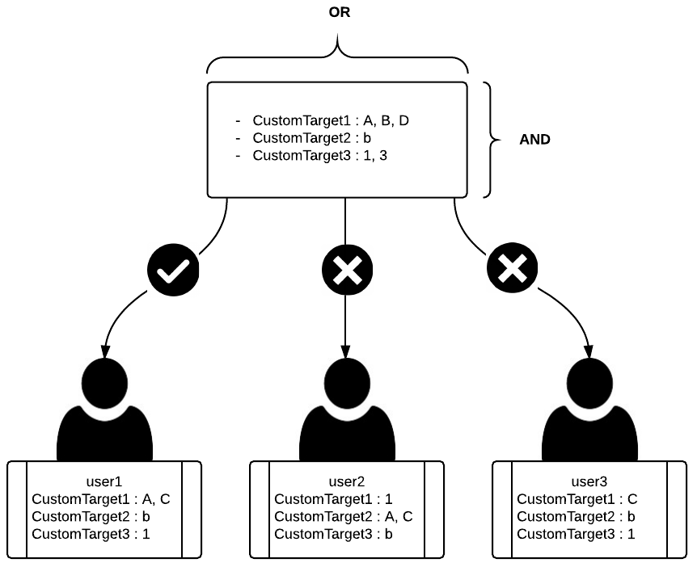
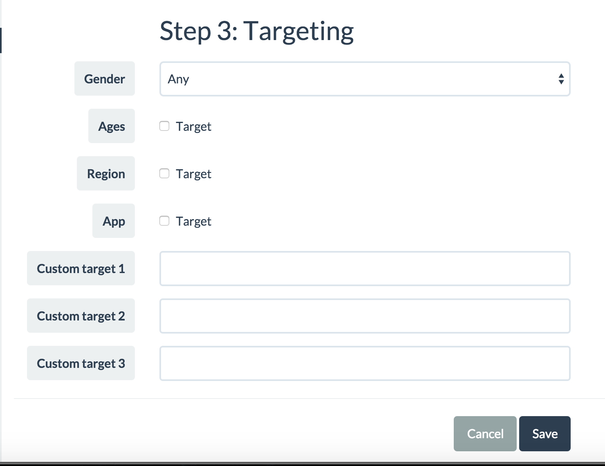

# BuzzScreen Custom Targeting
- Besides basic targeting methods using age/gender, Buzzscreen provides more advanced targeting features which can be set up using cutom targeting fields. These custom user profile data must be provided by publishers.
- BuzzScreen provides up to **3 custom Targeting Fields**.
- In order to enable custom targeting features, user profile data to be used for targeting should be set up on client side during the integration process and then advertising operation manager sets the custom targeting value when creating campaigns on the BuzzScreen dashboard.


## Definition of Terms
- Targeting Field : Targeting Fields are attributes that can categorize users into several groups in a way that helps improve the effeciency/effectiveness of advertising campaigns by targeing a specific group to meet a unique objective of the campaigns. (e.g, Interest)
- Targeting Value : Each Targeting Field includes a list of Targeting Values, predefined, to distinguish each group of users from the others. (e.g, Interest (Targeting Field) - Tech (Targeting Value 1), Business (Targeting Value 2), Travle (Targeting Value 3), and so on)


## Note
- Targeting Field that is set up in a campaign will be used as **condition**, the campaign will be displayed **only** to users with the condition met.
  > Campaign with no Targeting Field set will be displayed to all users. The more Targeting Fields you set up for a campaign, the less users will be exposed to the campaign.
  
- Users with Targeting Fields filled/set up will be **eligible** for receiving campaigns with targeting criteria.	

- It is possible for campaign and user to have multiple Targeting Fields. **`AND Condition`** will apply when multiple Targeting Fields are set in a campaign.
  > Basic Targeting Fields and Custom Targeting Fields will have the equal priority.

- It is possible for one Targeting Fields to have multiple Targeting Values. **`OR Condition`** will apply when multiple Targeting Values are set in a Targeting Field.
  > If a user meets more than one Targeting Value in the Targeting Field, then the user is eligible for receiving the campaign. 
  
- The Custom Targeting Fields are mutually exclusive and independently handled. It is required to define what Field will represent what information in advance.

### Examples

- `user1` : Eligble for receiving the campaign. Although `user1` has `C` as Targeting Value in the Targeting Value (`CustomTarget1`), the user is still eligible thanks to `A` in it. Remember multiple Targeting Values in the Fields work in `OR Condition`.
- `user2` : Targeting Values of `CustomTarget1` and `CustomTarget2` are alternated. Not eligible for receiving the campaign.
- `user3` : It has the right Targeting Values in `CustomTarget2` and `CustomTarget3` but `CustomTarget1`. Not eligible for receiving the campaign due to failing to satisfying `AND Condition` among all the Targeting Fields.


## How to Apply Custom Targeting
Please follow the 3 steps as described below:
`1. Define Custom Targeting Fields -> 2. Define Targeting Values in the Targeting Fields -> 3. Apply Targeting Setting`

### 1. Define Custom Targeting Fields
Define what to assign to each Targeting Field.
- e.g, CustomTarget1 = Interest, CustomTarget2 = Marital Status

> Note : When defining the Targeting Fields, the number should be assigned to each Field. (See `user2` in the Examples above)

### 2. Define Targeting Values in the Targeting Fields

- e.g, Define Targeting Values as `Book`, `Travel`, `Music`, `Sports` in `Interest` Field. 
- e.g, Define Targeting Value as `Married`, `Single`, in `Marital Status` Field.

> Note : The formats between User Profile and Targeting Values in campaign should be matched.

### 3. Apply Targeting Setting
#### Set Targeting Values from UserProfile
- Receive UserProfile by calling `BuzzScreen.getInstance().getUserProfile()`
- Set Targeting Values as String in UserProfile by calling `setCustomTarget1()`, `setCustomTarget2()`, `setCustomTarget3()`.
- When assigning multiple Targeting Values in Field, use comma without space to distinguish the Values in one String. (See Code Samples)

##### Code Samples
```Java
	UserProfile userProfile = BuzzScreen.getInstance().getUserProfile();
	
	userProfile.setUserId(...);
	userProfile.setBirthYear(...);
	...
	// CustomTarget1 : Interest
	userProfile.setCustomTarget1("music,travel");
    // CustomTarget2 : Marital status
    userProfile.setCustomTarget2("married");
```

#### Set Targetings in Campaign
Set up Targeting conditions on your BuzzScreen dashboard.'Custom target 1, 2, 3' are the fields to input your Targeting Values.

