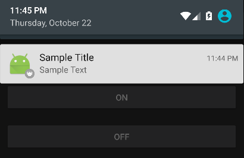

# 잠금화면 서비스 노티피케이션
버즈스크린이 동작하기 위해서는 버즈스크린 잠금화면 서비스가 [Foregound Service](http://developer.android.com/guide/components/services.html#Foreground)로 실행됩니다. Foreground Service 실행 중인 경우는 반드시 노티피케이션을 보여주도록 되어있는데, 이는 유저 경험상 좋지 않기 때문에 버즈스크린에서는 "최대한" 보여주지 않도록 노력하고 있습니다. 그래도 특정 상황에서는 노티피케이션이 노출 될 수 있기 때문에 이를 대비하여 다음과 같이 해당 노티피케이션의 설정을 수정가능 하도록 지원하고 있습니다.

> 노티피케이션이 보여지는 상황 : compile sdk version 23 이상, target sdk version 23이상, 그외의 간헐적인 예외 상황

## 잠금화면 서비스 노티피케이션 설정
**LockerServiceNotificationConfig** 클래스를 통해 접근(getter) 및 변경(setter)을 할 수 있으며, 다음 설정 값을 지원합니다. 반드시 BuzzScreen.init 다음에 호출해주어야 합니다.
- **Title** : 노티피케이션의 상단 타이틀(String). 기본값은 앱 명칭.
- **Text** : 노티피케이션의 하단 텍스트(String). 기본값은 빈 문자열("").
- **SmallIcon** : 노티피케이션의 작은 아이콘 이미지(int). 기본값은 앱 아이콘.
- **LargeIcon** : 노티피케이션의 큰 아이콘 이미지(int). 기본값은 없음.
- **ShowAlways** : 노티피케이션을 항상 보여줄지 유무(boolean). 위 설정 값들이 제대로 나오는지 테스트 목적으로도 사용 가능. 기본값은 false.
- **Intent** : 노티피케이션 클릭 시 실행될 인텐트(Intent). 기본값은 앱의 첫 액티비티(Launcher Activity)로의 이동 인텐트.

### 사용 예제
```Java
public class App extends Application {

    @Override
    public void onCreate() {
        super.onCreate();
        ...
        BuzzScreen.init("app_key", this, SimpleLockerActivity.class, R.drawable.image_on_fail, false);

        // 노티피케이션 설정
        LockerServiceNotificationConfig config = BuzzScreen.getInstance().getLockerServiceNotificationConfig();
        config.setTitle("Sample Title");
        config.setText("Sample Text");
        config.setSmallIconResourceId(R.drawable.ic_noti_small);
        config.setLargeIconResourceId(R.drawable.ic_noti_large);
        // config.setShowAlways(true);
    }
}
```
#### 예제 노티피케이션


## 잠금화면 서비스 노티피케이션 활용
서비스 노티피케이션이 노출되어 있는 상태에서 노티피케이션을 추가적으로 띄울 경우(적립 알림 등), 한 앱에서 다수의 노티피케이션이 알림바에 나타나기 때문에 유저 경험상 좋지 않을 수 있다. SDK에서 제공하는 메소드를 통해 서비스 노티피케이션이 있던 곳에 새로운 노티피케이션을 띄우고, 다시 원래의 서비스 노티피케이션으로 돌아갈 수 있다.

> 주의 : 이 기능을 사용할 때에는 반드시 LockerServiceNotificationConfig 에서 ShowAlways 값을 true로 설정해야 한다. 설정하지 않을 경우 메소드가 작동하지 않는다.

- `BuzzScreen.getInstance.notifyOnServiceNotification(Notification notification)` : 퍼블리셔 측에서 빌드가 완료된 notification을 이 메소드의 파라미터로 전달하면, 해당 notification을 서비스 노티피케이션이 위치한 곳에 띄운다. 다시 원래의 서비스 노티피케이션으로 돌아가려면(LockerServiceNotificationConfig에서 설정한 상태) 파라미터로 null 을 전달하여 이 메소드를 다시 호출하면 된다.
